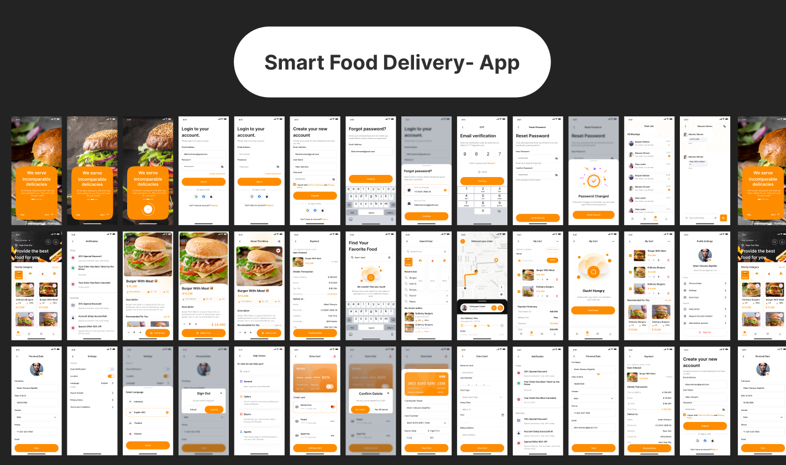

# 🍔 Smart Food Delivery App


A cross-platform **Flutter-based food delivery application** built using clean architecture
principles (MVVM), **Riverpod** for state management, and a highly responsive UI optimized for
Android and iOS devices.

---

## 🚀 Features

- 🧭 Persistent Bottom Navigation with nested navigation
- 🛍️ Product listing with cart support
- 🛒 Add to cart, remove, update quantities
- 💳 Order flow and delivery information bar
- 🧑 Profile & Personal Information screens
- 💬 Chat screen UI
- 🎯 Onboarding flow and launcher splash screen
- 📱 Fully responsive across screen sizes
- 🔧 MVVM + Riverpod + Clean folder architecture

---

## 📸 Screenshots

| Home                                 | Product Details                            | Cart                                 | Profile                                    |
|--------------------------------------|--------------------------------------------|--------------------------------------|--------------------------------------------|
|  |  |  |  |

> 📁 You can add your own screenshots inside `assets/screenshots/` and update paths above.

---

## 🔥 App Preview

> Live mobile preview (UI mockup)



---

## 🧠 Architecture

- **State Management**: [Riverpod](https://riverpod.dev/)
- **Pattern**: MVVM (Model-View-ViewModel)
- **Navigation**: `persistent_bottom_nav_bar_v2`
- **Responsiveness**: `flutter_screenutil`

```
lib/
│
├── main.dart
├── core/               # Common helpers, constants, resources
├── models/             # Data models
├── viewmodels/         # Business logic
├── views/              # UI Screens
├── widgets/            # Reusable UI components
└── routes/             # Navigation configuration
```

---

## 📦 Dependencies

```yaml
flutter_riverpod: ^2.6.1
persistent_bottom_nav_bar_v2: ^6.0.1
flutter_screenutil: ^5.8.4
```

> You can install them with:
> `flutter pub get`

---

## 🛠️ Getting Started

### 1. Clone the repo

```bash
git clone https://github.com/Suffixdigital/Smart-Food-Delivery.git
cd Smart-Food-Delivery
```

### 2. Get packages

```bash
flutter pub get
```

### 3. Run the app

```bash
flutter run
```

---

## 📁 Assets & Configuration

Make sure your `pubspec.yaml` includes:

```yaml
flutter:
  assets:
    - assets/images/
    - assets/icons/
```

To customize launcher icon/splash:

```bash
flutter pub run flutter_native_splash:create
flutter pub run flutter_launcher_icons:main
```

---

## 📄 License

This project is licensed under the [MIT License](LICENSE).

---

## 🤝 Contributing

Contributions, issues, and feature requests are welcome!  
Feel free to open an issue or submit a PR.

---

## 🙌 Maintainer

Developed by **[Suffix Digital](https://github.com/Suffixdigital)**  
📫 Feel free to connect for collaboration or feedback.
